Untitled
================
Ozan Kepir
11/25/2021

``` r
get_modes <- function(x) {
  ux <- unique(x)
  tab <- tabulate(match(x, ux));
  ux[tab == max(tab)]
}
```

# ———- Basic R functions ———

## Exercise

Compute your own age using the method above.

``` r
current_year <- 2021
birthday <- 1991
age <- (current_year - birthday)
print(age)
```

    ## [1] 30

You pay participants 8€ per hour. You normally have about 300
participants per week. The duration of the experiments varies between
15min, 30min, and sometimes 45min. Also, your research assistants’
salaries amount to 100€ per week. Write an algorithm to estimate weekly
experiment costs where duration is an object whose value can be changed.

``` r
duration <- 30
cost = (((duration/60) * 8 * 300) + 100)
print(cost)
```

    ## [1] 1300

## Exercise

Compute our height if we were 7cm shorter.

``` r
height <- c(1.82, 1.69, 1.68, 1.91, 1.54, 1.63)
height - 0.07
```

    ## [1] 1.75 1.62 1.61 1.84 1.47 1.56

``` r
print(height)
```

    ## [1] 1.82 1.69 1.68 1.91 1.54 1.63

This is the formula for the Body-Mass-Index BMI = bodymass / height^2
Generate a vector with the BMI values based on the following mass and
height vectors.

``` r
bodymass <- c(72, 63, 55, 89, 40)
height2 <- c(1.8, 1.5, 1.6, 1.9, 1.3)
BMI <- (bodymass/height2^2)
print(BMI)
```

    ## [1] 22.22222 28.00000 21.48437 24.65374 23.66864

You want to measure how well people could follow a lecture. Among other
questions, participants have to indicate their agreement from 1 (not at
all) to 7 (very much) to the statement “I did not understand anything.”
You now want to recode the answers of your participants so that higher
values indicate better understanding. Please recode the following
vector: answers \<- c(1,4,5,3,7,2,5,3,6,2,4,5,3,6,7,1)

``` r
answers <- c(1,4,5,3,7,2,5,3,6,2,4,5,3,6,7,1)
new_answers <- (8 - answers)
print(new_answers)
```

    ##  [1] 7 4 3 5 1 6 3 5 2 6 4 3 5 2 1 7

# ———– Data preparation 1 ———-

## Exercise

Determine what the variable (column) names in the “bechdel” data set
are.

``` r
colnames(bechdel)
```

    ##  [1] "year"          "decade_code"   "title"         "director"     
    ##  [5] "writer"        "plot"          "clean_test"    "budget"       
    ##  [9] "domgross"      "intgross"      "budget_2013"   "domgross_2013"
    ## [13] "intgross_2013" "metascore"     "imdb_rating"   "awards"

How many rows does the bechdel data set have?

``` r
ncol(bechdel)
```

    ## [1] 16

Visualize the bechdel data set

``` r
vis_dat(bechdel)
```

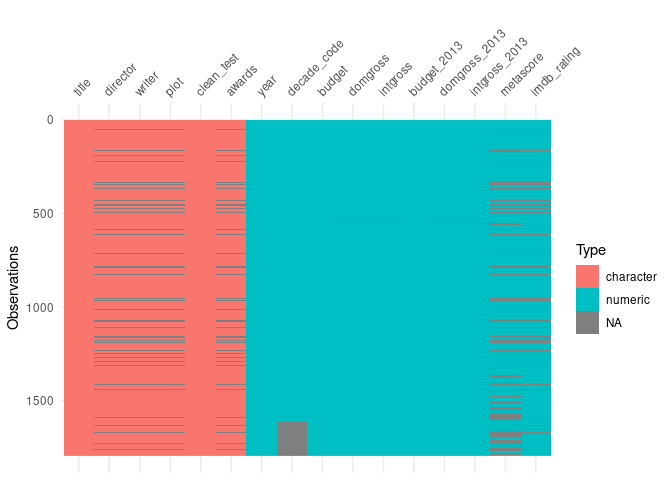<!-- --> #
—————–Data preparation 2 ———

## Exercise

Keep only movies that were released after 2010. How many observations do
you have?

``` r
filter(movies, release_date >2010) %>% 
  nrow()
```

    ## [1] 923

Keep only rows where the PG rating is “PG-13” and which belong to the
“Comedy”, “Horror”, or “Drama” genre.

``` r
filter(movies, (mpaa_rating == "PG-13" & genre == c("Comedy","Horror", "Drama")))
```

    ## Warning in genre == c("Comedy", "Horror", "Drama"): longer object length is not
    ## a multiple of shorter object length

    ## # A tibble: 248 × 8
    ##    release_date movie            production_budg… domestic_gross worldwide_gross
    ##           <dbl> <chr>                       <dbl>          <dbl>           <dbl>
    ##  1         2008 The Curious Cas…        160000000      127509326       329631958
    ##  2         2014 Exodus Gods and…        140000000       65014513       268314513
    ##  3         2014 Noah                    130000000      101200044       352831065
    ##  4         2008 Australia               130000000       49554002       215080810
    ##  5         1997 Dante's Peak            115000000       67163857       178200000
    ##  6         2010 The Other Guys          100000000      119219978       170936470
    ##  7         2001 Artificial Inte…         90000000       78616689       235900000
    ##  8         2017 The Promise              90000000        8224288        10551417
    ##  9         2003 Seabiscuit               86000000      120277854       148715342
    ## 10         2005 Memoirs of a Ge…         85000000       57010853       161510853
    ## # … with 238 more rows, and 3 more variables: distributor <chr>,
    ## #   mpaa_rating <chr>, genre <chr>

## Exercise

Move the genre column to the front.

``` r
select(movies, genre, everything())
```

    ## # A tibble: 3,401 × 8
    ##    genre     release_date movie  production_budg… domestic_gross worldwide_gross
    ##    <chr>            <dbl> <chr>             <dbl>          <dbl>           <dbl>
    ##  1 Comedy            2007 Evan …        175000000      100289690       174131329
    ##  2 Action            1995 Water…        175000000       88246220       264246220
    ##  3 Adventure         2017 King …        175000000       39175066       139950708
    ##  4 Action            2013 47 Ro…        175000000       38362475       151716815
    ##  5 Action            2018 Juras…        170000000      416769345      1304866322
    ##  6 Action            2014 Guard…        170000000      333172112       771051335
    ##  7 Action            2010 Iron …        170000000      312433331       621156389
    ##  8 Action            2014 Capta…        170000000      259746958       714401889
    ##  9 Adventure         2014 Dawn …        170000000      208545589       710644566
    ## 10 Adventure         2004 The P…        170000000      186493587       310634169
    ## # … with 3,391 more rows, and 2 more variables: distributor <chr>,
    ## #   mpaa_rating <chr>

Select all columns in the bechdel data set that measure movie budget.

``` r
select(bechdel, contains("budget"))
```

    ## # A tibble: 1,794 × 2
    ##       budget budget_2013
    ##        <dbl>       <dbl>
    ##  1  13000000    13000000
    ##  2  45000000    45658735
    ##  3  20000000    20000000
    ##  4  61000000    61000000
    ##  5  40000000    40000000
    ##  6 225000000   225000000
    ##  7  92000000    92000000
    ##  8  12000000    12000000
    ##  9  13000000    13000000
    ## 10 130000000   130000000
    ## # … with 1,784 more rows

Remove all columns from the bechdel data set that indicate values
adjusted to 2013 prices.

``` r
select(bechdel, -ends_with("2013"))
```

    ## # A tibble: 1,794 × 13
    ##     year decade_code title  director writer   plot    clean_test budget domgross
    ##    <dbl>       <dbl> <chr>  <chr>    <chr>    <chr>   <chr>       <dbl>    <dbl>
    ##  1  2013           1 21 &a… <NA>      <NA>    <NA>    notalk     1.3 e7 25682380
    ##  2  2012           1 Dredd… <NA>      <NA>    <NA>    ok         4.5 e7 13414714
    ##  3  2013           1 12 Ye… Steve M… "John R… In the… notalk     2   e7 53107035
    ##  4  2013           1 2 Guns Baltasa… "Blake … A DEA … notalk     6.1 e7 75612460
    ##  5  2013           1 42     Brian H… "Brian … The li… men        4   e7 95020213
    ##  6  2013           1 47 Ro… Carl Ri… "Chris … A band… men        2.25e8 38362475
    ##  7  2013           1 A Goo… John Mo… "Skip W… John M… notalk     9.2 e7 67349198
    ##  8  2013           1 About… Richard… "Richar… At the… ok         1.2 e7 15323921
    ##  9  2013           1 Admis… Paul We… "Karen … A Prin… ok         1.3 e7 18007317
    ## 10  2013           1 After… M. Nigh… "Gary W… A cras… notalk     1.3 e8 60522097
    ## # … with 1,784 more rows, and 4 more variables: intgross <dbl>,
    ## #   metascore <dbl>, imdb_rating <dbl>, awards <chr>

## Exercise

Create a column for the bechdel data set that computes how old the
movies are (think about last week’s session to compute our ages for
inspiration). Move that column to the front of the data set.

``` r
mutate(.data = bechdel,how_old = (2021-bechdel$year)) %>% 
  select(how_old,everything())
```

    ## # A tibble: 1,794 × 17
    ##    how_old  year decade_code title  director  writer   plot    clean_test budget
    ##      <dbl> <dbl>       <dbl> <chr>  <chr>     <chr>    <chr>   <chr>       <dbl>
    ##  1       8  2013           1 21 &a… <NA>       <NA>    <NA>    notalk     1.3 e7
    ##  2       9  2012           1 Dredd… <NA>       <NA>    <NA>    ok         4.5 e7
    ##  3       8  2013           1 12 Ye… Steve Mc… "John R… In the… notalk     2   e7
    ##  4       8  2013           1 2 Guns Baltasar… "Blake … A DEA … notalk     6.1 e7
    ##  5       8  2013           1 42     Brian He… "Brian … The li… men        4   e7
    ##  6       8  2013           1 47 Ro… Carl Rin… "Chris … A band… men        2.25e8
    ##  7       8  2013           1 A Goo… John Moo… "Skip W… John M… notalk     9.2 e7
    ##  8       8  2013           1 About… Richard … "Richar… At the… ok         1.2 e7
    ##  9       8  2013           1 Admis… Paul Wei… "Karen … A Prin… ok         1.3 e7
    ## 10       8  2013           1 After… M. Night… "Gary W… A cras… notalk     1.3 e8
    ## # … with 1,784 more rows, and 8 more variables: domgross <dbl>, intgross <dbl>,
    ## #   budget_2013 <dbl>, domgross_2013 <dbl>, intgross_2013 <dbl>,
    ## #   metascore <dbl>, imdb_rating <dbl>, awards <chr>

Compute the overall boxoffice success adjusted to 2013 prices (made up
of domgross_2013 and intgross_2013) for each movie in the bechdel data
set.

``` r
mutate(.data = bechdel, overall = domgross_2013 + intgross_2013) %>% 
  select(overall,everything())
```

    ## # A tibble: 1,794 × 17
    ##      overall  year decade_code title  director  writer  plot   clean_test budget
    ##        <dbl> <dbl>       <dbl> <chr>  <chr>     <chr>   <chr>  <chr>       <dbl>
    ##  1  67878146  2013           1 21 &a… <NA>       <NA>   <NA>   notalk     1.3 e7
    ##  2  55078343  2012           1 Dredd… <NA>       <NA>   <NA>   ok         4.5 e7
    ##  3 211714070  2013           1 12 Ye… Steve Mc… "John … In th… notalk     2   e7
    ##  4 208105475  2013           1 2 Guns Baltasar… "Blake… A DEA… notalk     6.1 e7
    ##  5 190040426  2013           1 42     Brian He… "Brian… The l… men        4   e7
    ##  6 184166317  2013           1 47 Ro… Carl Rin… "Chris… A ban… men        2.25e8
    ##  7 371598396  2013           1 A Goo… John Moo… "Skip … John … notalk     9.2 e7
    ##  8 102648667  2013           1 About… Richard … "Richa… At th… ok         1.2 e7
    ##  9  36014634  2013           1 Admis… Paul Wei… "Karen… A Pri… ok         1.3 e7
    ## 10 304895295  2013           1 After… M. Night… "Gary … A cra… notalk     1.3 e8
    ## # … with 1,784 more rows, and 8 more variables: domgross <dbl>, intgross <dbl>,
    ## #   budget_2013 <dbl>, domgross_2013 <dbl>, intgross_2013 <dbl>,
    ## #   metascore <dbl>, imdb_rating <dbl>, awards <chr>

Create a column called “pass” that says TRUE when the “clean_test”
variable for an observation is “ok” and FALSE when the variable is
anything else. THink of the logical operators that were introduced
above.

``` r
mutate(bechdel, pass= clean_test == "ok") %>% 
  select(pass,everything())
```

    ## # A tibble: 1,794 × 17
    ##    pass   year decade_code title  director  writer    plot     clean_test budget
    ##    <lgl> <dbl>       <dbl> <chr>  <chr>     <chr>     <chr>    <chr>       <dbl>
    ##  1 FALSE  2013           1 21 &a… <NA>       <NA>     <NA>     notalk     1.3 e7
    ##  2 TRUE   2012           1 Dredd… <NA>       <NA>     <NA>     ok         4.5 e7
    ##  3 FALSE  2013           1 12 Ye… Steve Mc… "John Ri… In the … notalk     2   e7
    ##  4 FALSE  2013           1 2 Guns Baltasar… "Blake M… A DEA a… notalk     6.1 e7
    ##  5 FALSE  2013           1 42     Brian He… "Brian H… The lif… men        4   e7
    ##  6 FALSE  2013           1 47 Ro… Carl Rin… "Chris M… A band … men        2.25e8
    ##  7 FALSE  2013           1 A Goo… John Moo… "Skip Wo… John Mc… notalk     9.2 e7
    ##  8 TRUE   2013           1 About… Richard … "Richard… At the … ok         1.2 e7
    ##  9 TRUE   2013           1 Admis… Paul Wei… "Karen C… A Princ… ok         1.3 e7
    ## 10 FALSE  2013           1 After… M. Night… "Gary Wh… A crash… notalk     1.3 e8
    ## # … with 1,784 more rows, and 8 more variables: domgross <dbl>, intgross <dbl>,
    ## #   budget_2013 <dbl>, domgross_2013 <dbl>, intgross_2013 <dbl>,
    ## #   metascore <dbl>, imdb_rating <dbl>, awards <chr>

## Exercise

Filter only movies between 2010 and 2013 and look at the average
domestic gross per year and genre (input both variables in the
group_by-function at the same time).

``` r
filter(movies, release_date >= 2010 & release_date <= 2013) %>%
  group_by(release_date, genre) %>% 
  summarise(mean(domestic_gross))
```

    ## `summarise()` has grouped output by 'release_date'. You can override using the `.groups` argument.

    ## # A tibble: 26 × 3
    ## # Groups:   release_date [4]
    ##    release_date genre     `mean(domestic_gross)`
    ##           <dbl> <chr>                      <dbl>
    ##  1         2010 Action                 62980270.
    ##  2         2010 Adventure              86853408.
    ##  3         2010 Comedy                 42734870.
    ##  4         2010 Drama                  25831881.
    ##  5         2010 Horror                 30573158.
    ##  6         2010 PG                      5000000 
    ##  7         2010 R                      13000000 
    ##  8         2011 Action                 69691975.
    ##  9         2011 Adventure              72289049.
    ## 10         2011 Comedy                 44071370.
    ## # … with 16 more rows

Compute the overall returns of movies per year starting 1990

``` r
filter(.data = movies, release_date >= 1990) %>% 
  mutate(overall_returns = domestic_gross + worldwide_gross) %>% 
  select(overall_returns, everything())
```

    ## # A tibble: 3,075 × 9
    ##    overall_returns release_date movie            production_budg… domestic_gross
    ##              <dbl>        <dbl> <chr>                       <dbl>          <dbl>
    ##  1       274421019         2007 Evan Almighty           175000000      100289690
    ##  2       352492440         1995 Waterworld              175000000       88246220
    ##  3       179125774         2017 King Arthur Leg…        175000000       39175066
    ##  4       190079290         2013 47 Ronin                175000000       38362475
    ##  5      1721635667         2018 Jurassic World …        170000000      416769345
    ##  6      1104223447         2014 Guardians of th…        170000000      333172112
    ##  7       933589720         2010 Iron Man 2              170000000      312433331
    ##  8       974148847         2014 Captain America…        170000000      259746958
    ##  9       919190155         2014 Dawn of the Pla…        170000000      208545589
    ## 10       497127756         2004 The Polar Expre…        170000000      186493587
    ## # … with 3,065 more rows, and 4 more variables: worldwide_gross <dbl>,
    ## #   distributor <chr>, mpaa_rating <chr>, genre <chr>

# ———- Data visualization ——–

``` r
movies <- drop_na(movies)
```

##EXERCISE Create a barplot to see how many movies are in each genre.

``` r
ggplot(data = movies,mapping = aes(x = genre))+
  geom_bar()
```

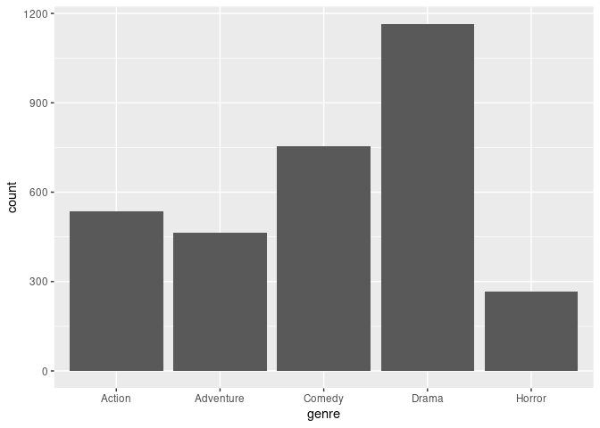<!-- -->

## EXERCISE

Create a histogram of worldwide gross earnings. Try changing the number
of bins to see how the plot changes:

``` r
ggplot(data = movies,mapping = aes(x = worldwide_gross, bins = 100)) +
  geom_histogram()
```

    ## `stat_bin()` using `bins = 30`. Pick better value with `binwidth`.

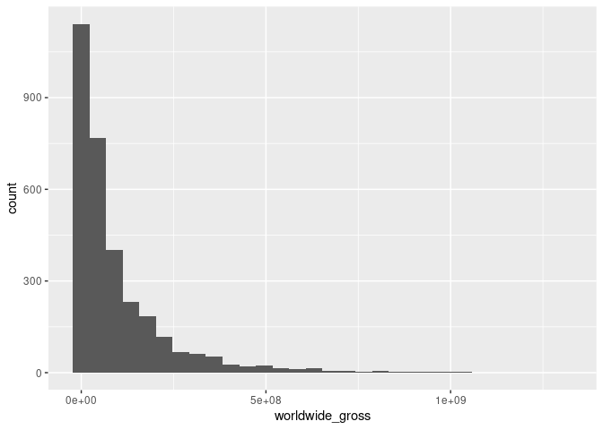<!-- -->
##EXERCISE Create a boxplot of the worldwide gross earnings by mpaa
rating:

``` r
ggplot(data = movies,mapping = aes(x = worldwide_gross,y = mpaa_rating)) +
  geom_boxplot() 
```

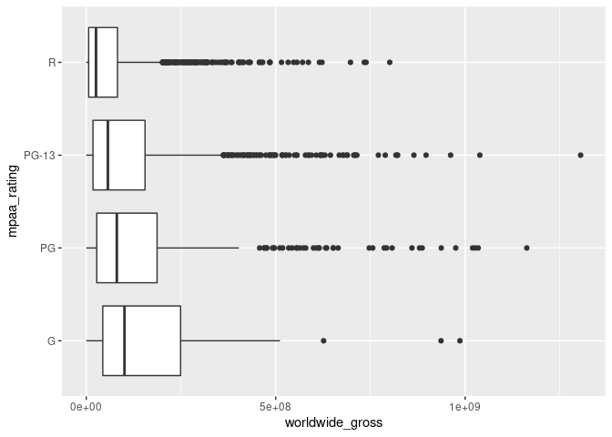<!-- -->
##EXERCISE Create a new dataset only keeping movies distributed by Walt
Disney, Warner Bros., Universal & Sony Pictures

``` r
ndf <- filter(movies, distributor == c("Sony Pictures", "Walt Disney", "Sony Pictures", "Warner Bros."))
```

Check that it worked

``` r
ggplot(data = ndf, mapping = aes(x = distributor))+
  geom_bar()
```

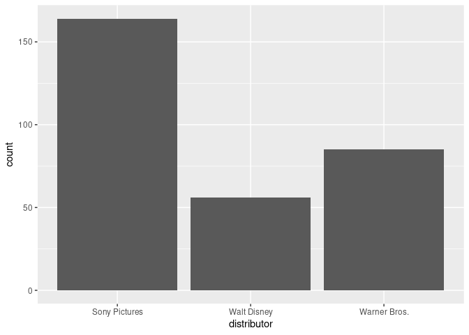<!-- -->

Create a barplot grid using facet wrap to look at the frequency of
genres for each distributor

``` r
ggplot(data = ndf, mapping = aes(x = genre)) +
  geom_bar() +
  facet_wrap(~distributor)
```

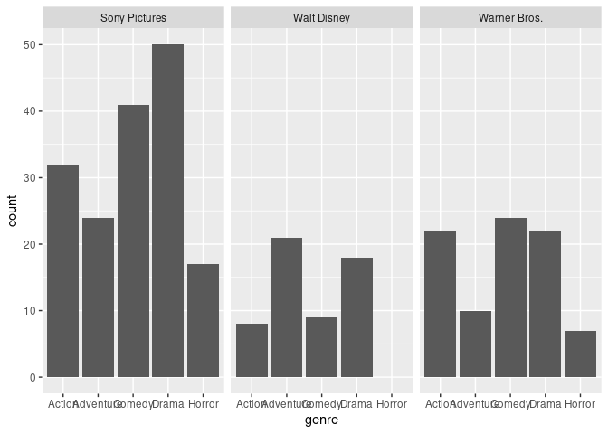<!-- -->

Create a juxtaposed barplot to show the frequency of mpaa_rating for
each distributor:

``` r
ggplot(data = ndf,mapping = aes(x = distributor, fill = mpaa_rating))+
  geom_bar(position = "dodge")
```

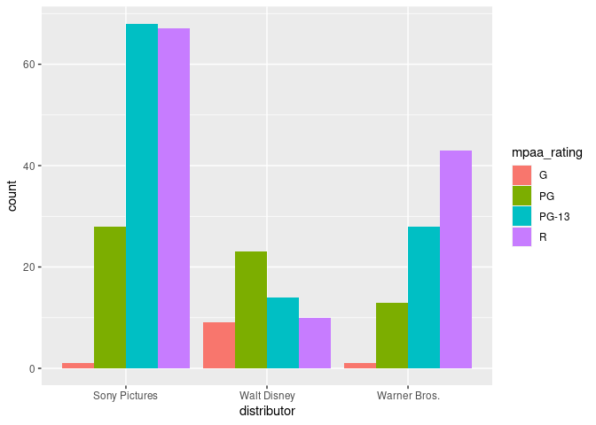<!-- -->
#————-Descriptive Statistics ## EXERCISE

Compute the mean, median and mode of production budget per genre Tip:
Use the “group_by” and “summarise” functions learned in the previous
sessions.

``` r
drop_na(movies) %>% 
  group_by(genre) %>%
  summarise(mean(movies$production_budget),median(movies$production_budget), get_modes(movies$production_budget))
```

    ## # A tibble: 5 × 4
    ##   genre     `mean(movies$production_budget)` `median(movies$p… `get_modes(movie…
    ##   <chr>                                <dbl>             <dbl>             <dbl>
    ## 1 Action                           34759731.          22000000          20000000
    ## 2 Adventure                        34759731.          22000000          20000000
    ## 3 Comedy                           34759731.          22000000          20000000
    ## 4 Drama                            34759731.          22000000          20000000
    ## 5 Horror                           34759731.          22000000          20000000

## EXERCISE

Think back to the data visualization session. How could we visually
represent the range and quartiles of production budget. Plot this graph.

``` r
ggplot(data = movies, aes(x = production_budget)) + 
  geom_boxplot()
```

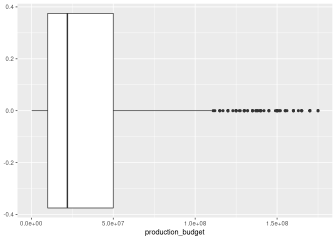<!-- -->
## EXERCISE:

``` r
bechdel <- bechdel %>% 
  drop_na()
```

Calculate the means and the standard deviations of `metascore` for each
decade (“decade_code”) represented in the data set. The decades are
coded as:

1 = 1990 - 1999 2 = 2000 - 2009 3 = 2010 - 2019

1.  Which decade has the highest degree of dispersion in metascore
    according to the different measures?

``` r
group_by(bechdel, decade_code) %>% 
  summarise(mean(metascore), sd(metascore))
```

    ## # A tibble: 3 × 3
    ##   decade_code `mean(metascore)` `sd(metascore)`
    ##         <dbl>             <dbl>           <dbl>
    ## 1           1              57.4            16.6
    ## 2           2              58.2            17.0
    ## 3           3              60.6            17.5

2.  Graph the overall metascore in a density plot, including vertical
    lines for mean and standard deviation:

``` r
sd <- sd(bechdel$metascore)
mean <- mean(bechdel$metascore)
ggplot(data = bechdel,mapping = aes(x =metascore)) + 
  geom_density() + 
  geom_vline(xintercept = mean, color = "red") + 
  geom_vline(aes(xintercept = mean + sd), color = "blue") +
  geom_vline(aes(xintercept = mean - sd), color = "blue")
```

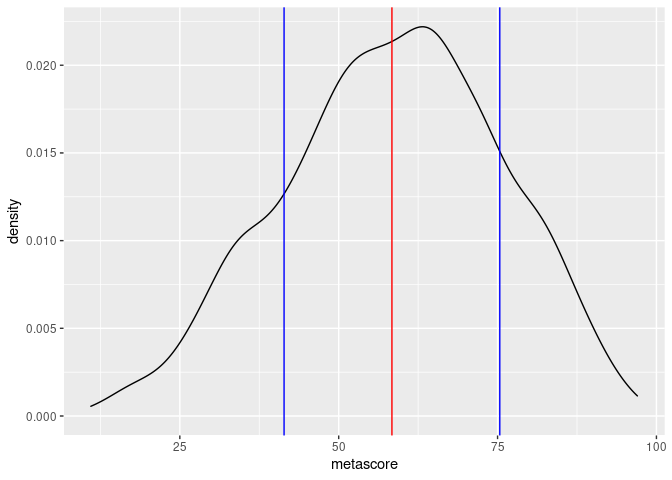<!-- -->

##EXERCISE

Before we calculate the numerical value, let’s have another look at the
density plot for production budget. What degree of skewness could we
expect here, and in which direction?

Now calculate skewness of production budget:

``` r
skewness(movies$production_budget)
```

    ## [1] 1.660383

Let’s do the same for the metascore variable from the bechdel dataset.
First look at the density plot and try to estimate the skewness. Then
calculate it.

``` r
ggplot(data = bechdel,mapping = aes(x = metascore)) + 
  geom_density()
```

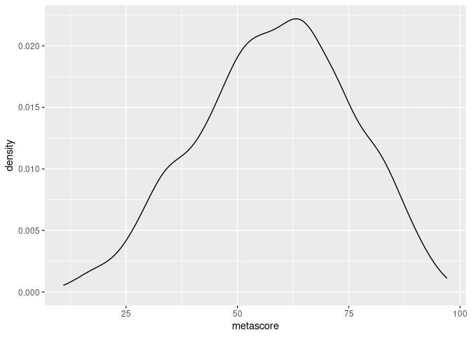<!-- -->

``` r
skewness(bechdel$metascore)
```

    ## [1] -0.189162

# EXERCISE

How would we represent this correlation visually? Use ggplot.

``` r
ggplot(data = movies, aes (x = production_budget, y = worldwide_gross)) + 
  geom_point(color = "red") + 
  geom_smooth(method = "lm")
```

    ## `geom_smooth()` using formula 'y ~ x'

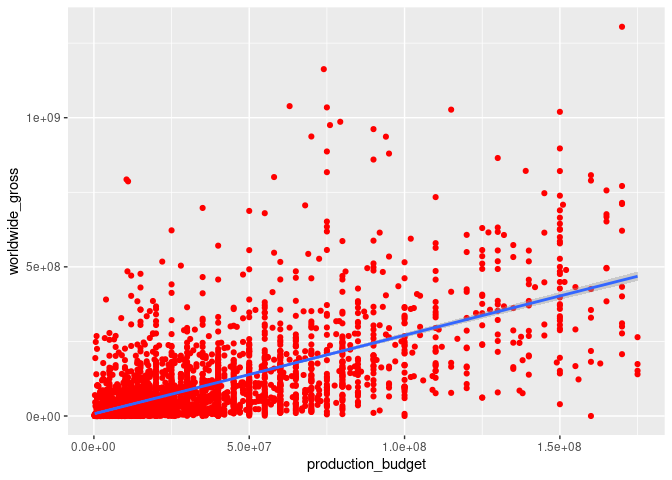<!-- -->
#EXERCISE

Create a new dataset with only the genres Comedy and Horror

``` r
df2 <- movies %>% 
  filter(genre == "Comedy" | genre == "Horror")
```

Is there a signficant difference in the domestic gross earnings of
comedy and horror movies?

``` r
leveneTest(domestic_gross ~ as.factor(genre),data = df2, center = "mean")
```

    ## Levene's Test for Homogeneity of Variance (center = "mean")
    ##         Df F value   Pr(>F)   
    ## group    1  10.589 0.001175 **
    ##       1016                    
    ## ---
    ## Signif. codes:  0 '***' 0.001 '**' 0.01 '*' 0.05 '.' 0.1 ' ' 1

``` r
t.test(domestic_gross ~as.factor(genre),data = df2)
```

    ## 
    ##  Welch Two Sample t-test
    ## 
    ## data:  domestic_gross by as.factor(genre)
    ## t = 1.2592, df = 498.85, p-value = 0.2085
    ## alternative hypothesis: true difference in means is not equal to 0
    ## 95 percent confidence interval:
    ##  -2241793 10243776
    ## sample estimates:
    ## mean in group Comedy mean in group Horror 
    ##             42141821             38140830
